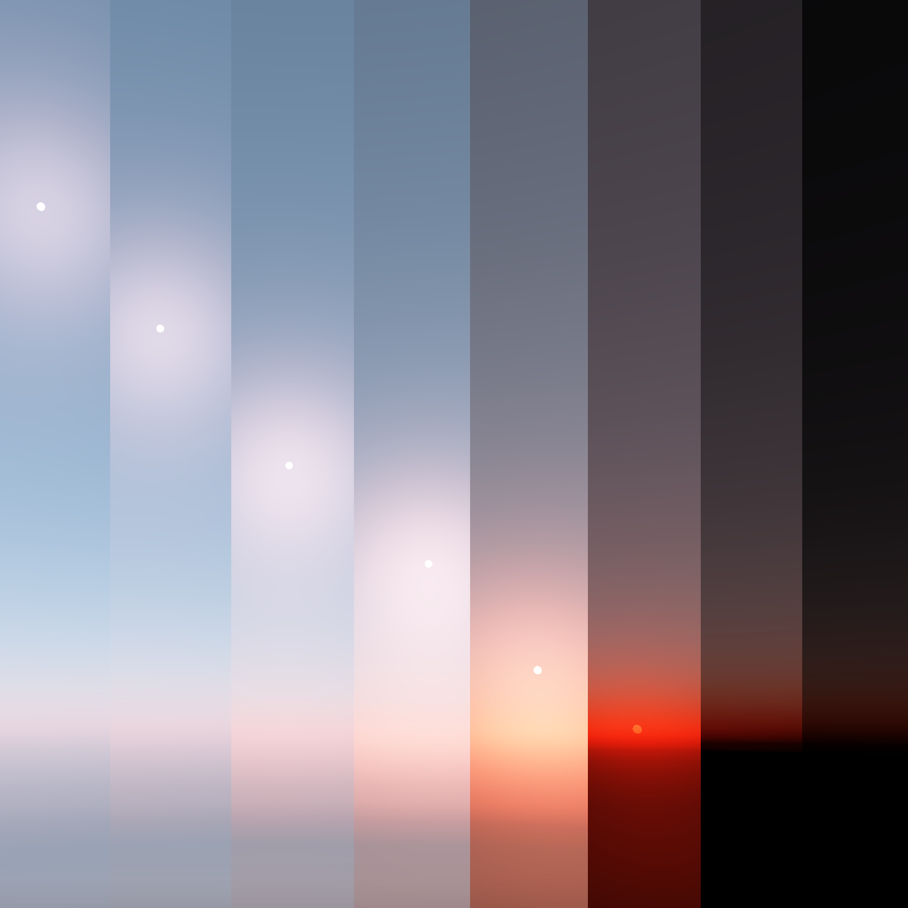

# Atmospheric Rendering

### [Web Demo](https://danielshervheim.com/atmosphere/)

 
## About

Rendering realistic and dynamic skies is a challenging problem in real-time computer graphics. The math behind light scattering is too complex to solve directly in real-time, but it can be done offline.

This program solves the atmospheric scattering equations for every possible view and sun direction, and stores the results in look-up tables. The tables can then be sampled in a fragment shader to reconstruct an accurate rendering of the sky at any time of day.

This branch contains the code that precomputes the scattering tables. For an example of using the precomputed data in a renderer, please look at this repository's `gh-pages` branch.

## Background

Before light reaches your eye, there is a probability a portion of it will be absorbed by aerosols (Mie theory) or scattered into a different direction by molecules (Rayleigh theory).

The amount of light reaching your eye after undergoing either Rayleigh or Mie scattering within the atmosphere is described by the following equation:

For a complete explanation of the math behind atmospheric scattering, I recommend Gustav Bodare and Edvard Sandberg's excellent [thesis](http://publications.lib.chalmers.se/records/fulltext/203057/203057.pdf) on atmospheric scattering.

## How To Use

This program precomputes the above integral for:

- 2 scattering events (Rayleigh and Mie).
- 3 wavelengths (which roughly correspond to red, green, and blue).
- 64 view-zenith angles (from 0 to π).
- 64 sun-zenith angles (from 0 to π).

To use it:

1. Clone this repository.
2. `cd` into `atmosphere/`
3. Run `make`.
4. Run `./build/atmosphere`, or optionally `./build/atmosphere -o some/output/dir` to specifiy a custom output directory.

This program outputs three files:

1. `rayleigh.bin` contains the precomputed rayleigh scattering table in the form of a binary-encoded float array.
2. `mie.bin` contains the precomputed mie scattering table in the form of a binary-encoded float array.
3. `results.txt` contains the necessary constants to correctly render the atmosphere in your renderer of choice.

I excluded the spectral intensity `Ii(λ)` and phase function `F(θ)` terms from the results. They are constant anyway, and in deferring them to a fragment shader we can avoid some visual artifacts around the sun.

I also normalized the table values in the 0...1 range to preserve as much precision as possible when converting between floats and doubles. After you sample the table in a fragment shader, you must un-normalize the values with the following formula: `val = val * (max - min) + min`. The max and min values are written into `results.txt` as part of the precomputation process.

## Rendering

For a complete example of using the precomputed data in a renderer, please see this repository's `gh-pages` branch. The basic process is outlined below:

1. Load each table as a float array.
2. Create 64x64 RGB floating point textures from each array.
3. Upload the rayleigh and mie textures to the GPU.
4. In the fragment shader, convert the current view-zenith and sun-zenith angle into texture coordinates with the following formula:
   1. `u = 0.5 * (1.0 + sign(cosViewZenith)*pow(abs(cosViewZenith), 1.0/3.0));`
   2. `v = 0.5 * (1.0 + sign(cosSunZenith)*pow(abs(cosSunZenith), 1.0/3.0));`
5. Sample the rayleigh and mie textures with the texture coordinate `(u, v)`.
6. Remap the rayleigh and mie values with the `min` and `max` constants from `results.txt`.
7. Multiply the rayleigh and mie values with their respective phase functions.
8. Add the rayleigh and mie values to get the total scattering.
9. Multiply the total scattering by the spectral irradiance constants from `results.txt` to compute the radiance.
10. Multiply the radiance by the spectral-to-rgb conversion constants from `results.txt` to compute the rgb color.
11. Tonemap the rgb color via `rgb = pow(1.0 - exp(-rgb), 1.0/2.2)`.